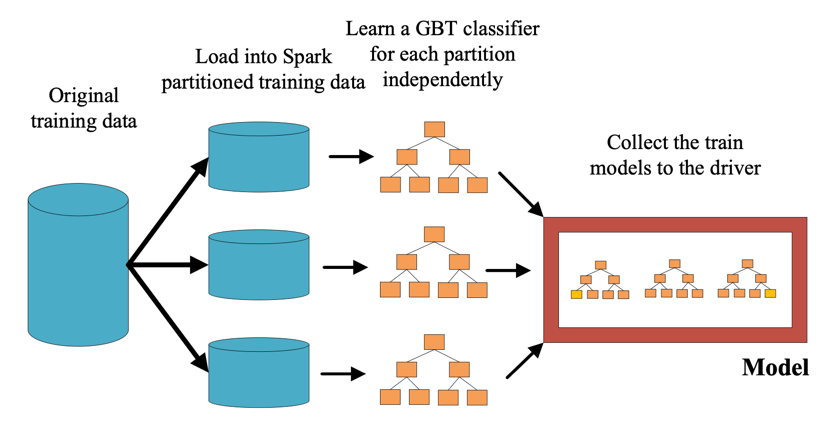
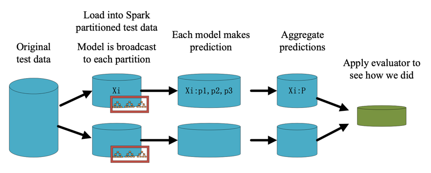

# Model training module

## Loading preprocessed data

- [ ] Import the data_process file method to preprocess the data and cache the training data.

## Feature selection

- [ ] Create a VectorAssembler transformer to merge the given input feature columns into a vector column.
- [ ] Create a feature selector ChiSqSelector to select the most relevant features based on the chi-square test. After comparing the effects of different numbers of features in selecting the most relevant features for the chi-square test, the final setting was 50 features.

## Model training

- [ ] Design a local GBT Classifier method. The data is split according to the number of partitions and the split data is distributed to different partitions. Then a gradient boosting tree classification model is trained on each data partition and the trained models are collected and saved as a list.

- [ ] Broadcast the trained local models to all partitions so that predictions can be made on each partition. Make predictions on each partition and vote on the prediction results to get the final prediction result.

- [ ] Combine the previously defined feature processing steps and the local GBT classifier model into a Pipeline.

## Compare the scalability of solution
-[ ] Compare the running speed of GBTclassifier in spark mllib and the running speed implemented in sklearn. In Spark MLlib, the running time is 5.109s, In sklearn, use the same model but the running time is 11.437s. 